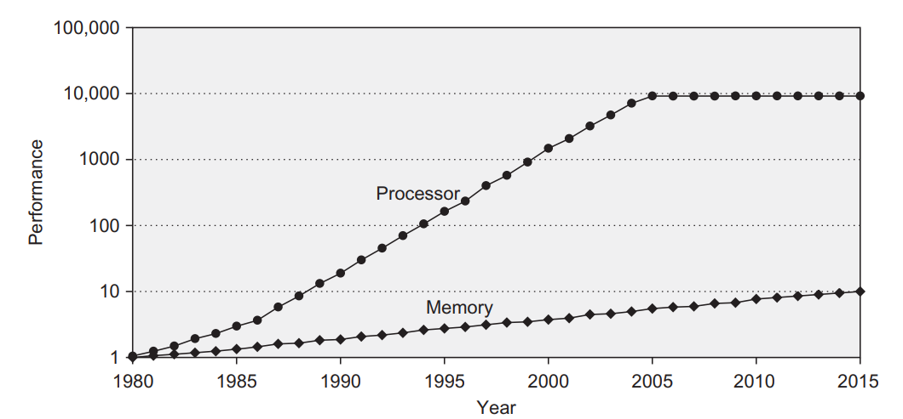
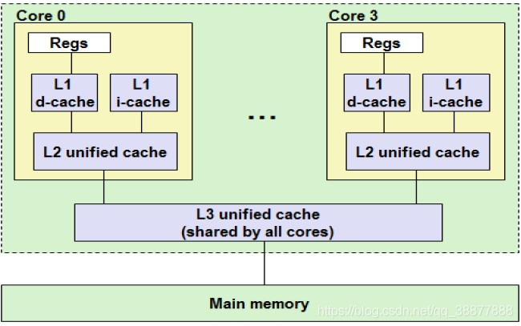
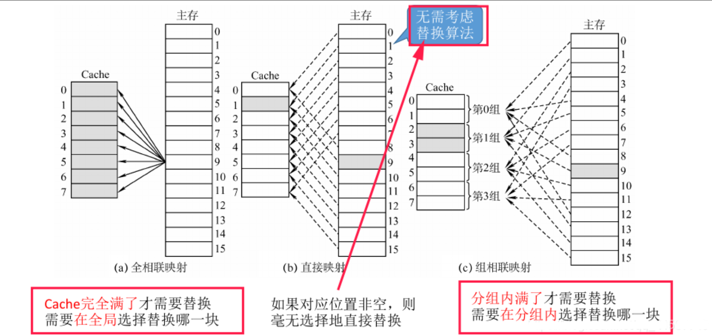
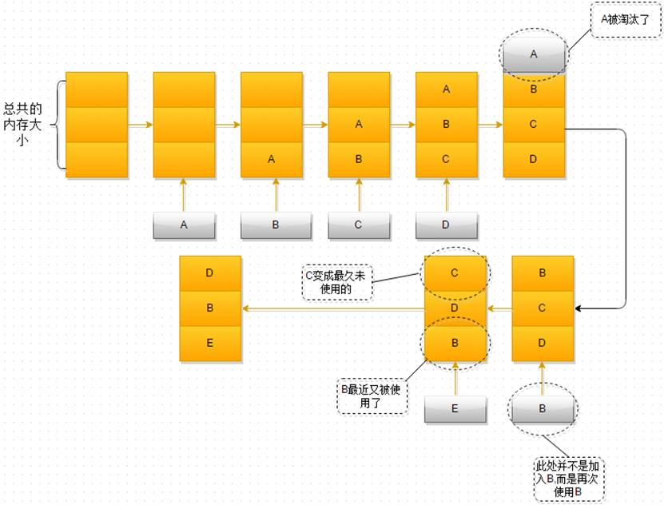
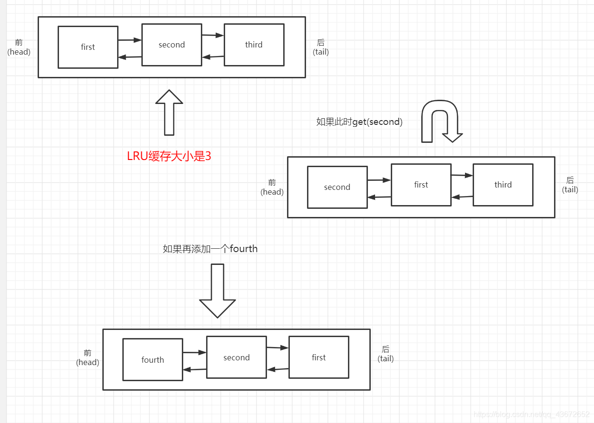

---
# You can also start simply with 'default'
theme: seriph
# random image from a curated Unsplash collection by Anthony
# like them? see https://unsplash.com/collections/94734566/slidev
background: https://cover.sli.dev
# some information about your slides (markdown enabled)
title: Cache算法和实现
info: |
  ## Slidev Starter Template
  Presentation slides for developers.

  Learn more at [Sli.dev](https://sli.dev)
# apply unocss classes to the current slide
class: text-center
# https://sli.dev/features/drawing
drawings:
  persist: false
# slide transition: https://sli.dev/guide/animations.html#slide-transitions
transition: slide-left
# enable MDC Syntax: https://sli.dev/features/mdc
mdc: true
# open graph
# seoMeta:
#  ogImage: https://cover.sli.dev
---

# Cache算法和实现

及最近最少使用算法LRU的实现

殷俊小组 


<div @click="$slidev.nav.next" class="mt-12 py-1" hover:bg="white op-10">
  Press Space for next page <carbon:arrow-right />
</div>

<div class="abs-br m-6 text-xl">
  <button @click="$slidev.nav.openInEditor()" title="Open in Editor" class="slidev-icon-btn">
    <carbon:edit />
  </button>
</div>

---
layout: two-cols
layoutClass: gap-16
---

# contents

我们将从以下<span v-mark.underline.orange>六个方面</span>介绍`Cache`相关算法，

::right::
<br>

## 1.	CPU缓存是什么?
<br>

## 2.	缓存的作用
<br>

## 3.	为什么需要cache
<br>

## 4.	多级缓存
<br>

## 5.	Cache替换算法
<br>

## 6. 最近最少使用算法LRU的实现
<br>

---
transition: fade-out
---
#	CPU缓存是什么?
- Cache是为了给CPU提供高速存储访问，利用数据局部性而设计的小存储单元。
位于CPU与内存之间，容量比内存小的多但是交换速度却比内存要快得多。
<br>
<br>

# 缓存的作用
- CPU高速缓存的出现主要是为了解决CPU运算速度与内存读写速度不匹配的矛盾，因为CPU运算速度要比内存读写速度快很多，这样会使CPU花费很长时间等待数据到来或把数据写入内存。在缓存中的数据是内存中的一小部分，但这一小部分是短时间内CPU即将访问的，当CPU调用大量数据时，就可先缓存中调用，从而加快读取速度。

<style>
h1 {
  background-color: #2B90B6;
  background-image: linear-gradient(45deg, #4EC5D4 10%, #146b8c 20%);
  background-size: 100%;
  -webkit-background-clip: text;
  -moz-background-clip: text;
  -webkit-text-fill-color: transparent;
  -moz-text-fill-color: transparent;
}
</style>

---
transition: fade-out
---

# 为什么需要cache
1. cpu速度快于内存读写速度100多倍。为了避免内存成为 CPU 速度的瓶颈
根据摩尔定律，CPU 的访问速度每 18 个月就会翻倍，相当于每年增长 60% 左右，内存的速度当然也会不断增长，但是增长的速度远小于 CPU，平均每年只增长 7% 左右。于是，CPU 与内存的访问性能的差距不断拉大。
<br>
<br>


上图是 CPU 性能和 Memory 存储器访问性能的发展

---
transition: fade-out
---

2. 程序处理的数据有局部性
<br>

**时间局部性**：最近访问的内容很可能在短期内被再次访问；
```ts
 for (int iter = 0; iter < 100; iter++) {
        for (int i = 0; i < 100; i++) {
            array[i] += 1;
        }
    }
```

**空间局部性**：地址相邻的内容很可能在相近的时间被用到
```ts
for (int i = 0; i < 100; i++) {
        for (int j = 0; j < 100; j++) {
            x[i][j] = 2 * x[i][j];  // 空间局部性
        }
    }
```
所以，我们可以用一小块快速的内存，来暂存目前需要的数据。

---
transition: fade-out
---
# 多级缓存
现代CPU为了提升执行效率一般在CPU上集成了多级缓存架构，常见的为大小不等的三级缓存结构。分别是 L1 Cache、L2 Cache 和 L3 Cache。其中L3是多个核心共享的。
<br>

- L1缓存分成两种，一种是指令缓存，一种是数据缓存。L2缓存和L3缓存不分指令和数据。在L1缓存中，有一个叫做Cache line的东西。 他表示cpu从一级缓存读取数据的最小单位。
- L1和L2缓存在每一个CPU核中，L3则是所有CPU核心共享的内存。
- L1、L2、L3的越离CPU近就越小，速度也就越快，越离CPU远，速度也越慢。


---
transition: fade-out
---
# Cache替换算法
- 在采用全相联映射和组相联映射方式时，从主存向 Cache 传送一个新块，当 Cache 中的空间被占满时，就需要使用替换算法置换 Cache行。而采用直接映射则不需要考虑替换算法。
<br>
<br>



---
transition: fade-out
---
# Cache替换算法

- 随机算法(RAND)：随机选择一块替换;
- 先进先出算法(FIFO)：替换最先被调入cache的块;
- 近期最少使用(LRU)：为每一个Cache块设置一个“计数器”,用于记录每个Cache块已经有多久没被访问了。当Cache满后替换“计数器”最大的;
- 最近不经常使用(LFU): 为每一个Cache块设置一个“计数器”,用于记录每个Cache块被访问的次数。当Cache满后替换“计数器”最小的;

---
transition: fade-out
---
# LRU 实现思路

1.  当缓存中存在需要访问的数据时（**缓存命中**），更新该数据的使用记录，使其成为最近使用的。
2.  当缓存中不存在需要访问的数据且缓存未满时（**缓存未命中**），将该数据添加到缓存中。
3.  当缓存中不存在需要访问的数据且缓存已满时（**缓存未命中且缓存满**），找到最近最少使用的数据并将其从缓存中移除，然后将新的数据添加到缓存中。
<br>



<style>
h1 {
  background-color: #2B90B6;
  background-image: linear-gradient(45deg, #4EC5D4 10%, #146b8c 20%);
  background-size: 100%;
  -webkit-background-clip: text;
  -moz-background-clip: text;
  -webkit-text-fill-color: transparent;
  -moz-text-fill-color: transparent;
}
</style>

---
transition: fade-out
---
# LRU cache的数据结构

* 结点node：存储键值对、前指针和后指针
* 哈希表：用于快速查找缓存中的键值对
* 双向链表：用于维护缓存中元素的访问顺序。链表的头部表示最近使用的元素，尾部表示最近最少使用的元素。
<br>


<style>
h1 {
  background-color: #2B90B6;
  background-image: linear-gradient(45deg, #4EC5D4 10%, #146b8c 20%);
  background-size: 100%;
  -webkit-background-clip: text;
  -moz-background-clip: text;
  -webkit-text-fill-color: transparent;
  -moz-text-fill-color: transparent;
}
</style>

---
transition: slide-up
---
# LRU 的基本操作
使用哈希表 + 双向链表实现 O(1) 时间复杂度的 get 和 put 操作

<div class="code-container">

```ts {all|5|7|7-8|10|all}
// 代码内容
import java.util.HashMap;
import java.util.Map;

/**
 * LRU
 * 使用哈希表 + 双向链表实现 O(1) 时间复杂度的 get 和 put 操作
 * @param <K> 键类型
 * @param <V> 值类型
 */
public class LRUCache<K, V> {
    /**
     * 双向链表节点类
     */
    private class Node {
        K key;
        V value;
        Node prev;
        Node next;

        public Node(K key, V value) {
            this.key = key;
            this.value = value;
        }
    }

    // 容量
    private final int capacity;
    // 哈希表用于快速查找
    private final Map<K, Node> cache;
    // 头节点
    private final Node head;
    // 尾节点
    private final Node tail;
    // 当前缓存大小
    private int size;

    /**
     * 构造函数
     * @param capacity 容量
     */
    public LRUCache(int capacity) {
        if (capacity <= 0) {
            throw new IllegalArgumentException("Capacity should be greater than 0");
        }
        this.capacity = capacity;
        this.cache = new HashMap<>();
        this.size = 0;
        
        // 初始化头尾节点
        this.head = new Node(null, null);
        this.tail = new Node(null, null);
        head.next = tail;
        tail.prev = head;
    }

    /**
     * 获取缓存值
     * @param key 键
     * @return 如果存在返回对应的值，否则返回null
     */
    public V get(K key) {
        Node node = cache.get(key);
        if (node == null) {
            return null;
        }
        
        // 将访问的节点移动到链表头部
        moveToHead(node);
        return node.value;
    }

    /**
     * 添加或更新cache
     * @param key 键
     * @param value 值
     */
    public void put(K key, V value) {
        Node node = cache.get(key);
        
        if (node == null) {
            // 如果键不存在，创建新节点
            Node newNode = new Node(key, value);
            cache.put(key, newNode);
            addToHead(newNode);
            size++;
            
            // 如果超过容量，移除最久未使用的节点
            if (size > capacity) {
                Node tailNode = removeTail();
                cache.remove(tailNode.key);
                size--;
            }
        } else {
            // 如果键已存在，更新值并移动到头部
            node.value = value;
            moveToHead(node);
        }
    }

    /**
     * 获取当前cache缓存大小
     * @return 缓存中元素的数量
     */
    public int size() {
        return size;
    }

    /**
     * 清空缓存
     */
    public void clear() {
        cache.clear();
        head.next = tail;
        tail.prev = head;
        size = 0;
    }

    /**
     * 将节点添加到链表头部
     * @param node 要添加的节点
     */
    private void addToHead(Node node) {
        node.prev = head;
        node.next = head.next;
        head.next.prev = node;
        head.next = node;
    }

    /**
     * 从链表中移除节点
     * @param node 要移除的节点
     */
    private void removeNode(Node node) {
        node.prev.next = node.next;
        node.next.prev = node.prev;
    }

    /**
     * 将节点移动到链表头部
     * @param node 要移动的节点
     */
    private void moveToHead(Node node) {
        removeNode(node);
        addToHead(node);
    }

    /**
     * 移除链表尾部节点
     * @return 被移除的节点
     */
    private Node removeTail() {
        Node tailNode = tail.prev;
        removeNode(tailNode);
        return tailNode;
    }
```

</div>

<style>
/* 添加自定义样式 */
.code-container {
  max-height: 75%;      /* 固定高度 */
  overflow-y: auto;       /* 启用竖向滚动条 */
  border-radius: 4px;     /* 圆角 */
  padding: 12px;
  margin: 10px 0;
}
</style>


---
layout: two-cols
transition: slide-up
---
<div class="thanks">
THANKS
</div>

<style>
.thanks {
  display: flex;
  justify-content: center;
  align-items: center;
  height:100%;
  font-size:80px;
}
</style>

::right::
<div class="qq">
组长：
<br>
殷俊（LRU算法）
<br>
<br>
组员：
<br>
刘雅萌（Cache及相关算法整体介绍）
<br>
肖可（PPT制作）
<br>
胥津晟（展示）
<br>
</div>

<style>
.qq {
  display: flex;
  justify-content: center;
  align-items: center;
  height:100%;
}
</style>